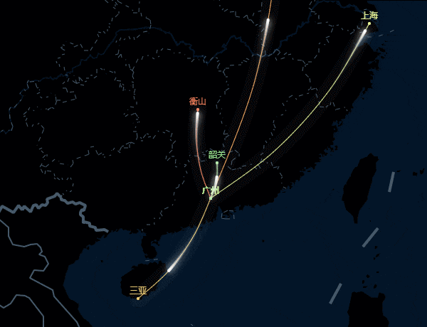
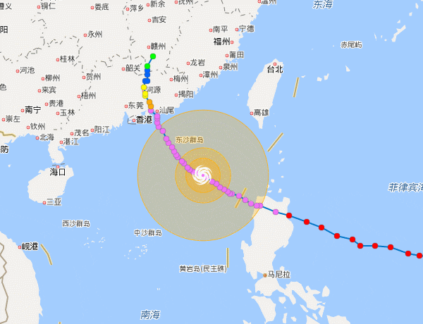
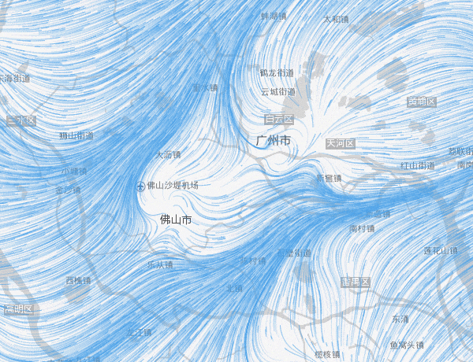
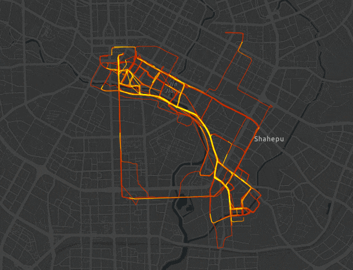
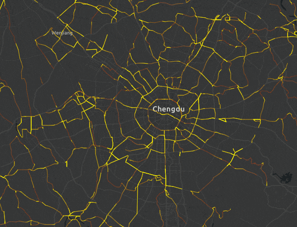
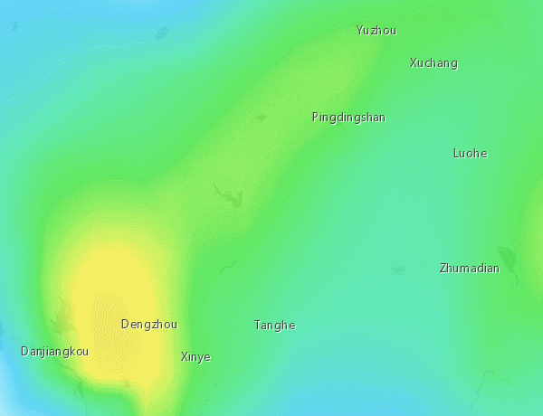
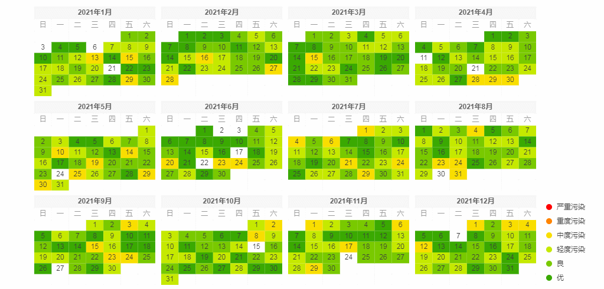
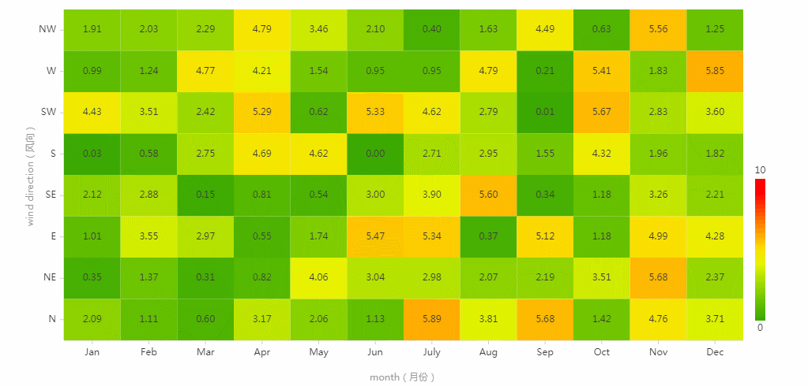

<!--
 * @Author: your name
 * @Date: 2017-03-15 21:36:45
 * @LastEditTime: 2021-04-12 23:45:38
 * @LastEditors: Please set LastEditors
 * @Description: In User Settings Edit
 * @FilePath: \map-canvas\README.md
-->
# map-canvas
基于baidu、google、openlayers、arcgis、高德地图扩展canvas图层，进行数据可视化。

## demos
|   [百度地图-闪烁](https://kobef08.github.io/map-canvas/examples/baidu-map-flashmarker.html)  |  [百度地图-迁徙](https://kobef08.github.io/map-canvas/examples/baidu-map-move.html) |
|  ----   | ----  |
|   |   | 
| [百度地图-台风](https://kobef08.github.io/map-canvas/examples/baidu-map-typhoon.html)  | [百度地图-风](https://kobef08.github.io/map-canvas/examples/baidu-map-wind.html) |
|     |   |
|   [城市交通流量](https://kobef08.github.io/map-canvas/examples/arcgis-map-move.html)  |  [城市路网模拟](https://kobef08.github.io/map-canvas/examples/arcgis-map-road.html) |
|     |   |
|  [区域AQI渲染](https://kobef08.github.io/dazv/examples/arcgis-map-temperature.html)   | [数据眼](https://kobef08.github.io/dazv/examples/canvas-dataEye.html)  |
|     |   |
|  [日历热力图-年度](https://kobef08.github.io/dazv/examples/canvas-calendar-year.html)   | [日历热力图-月度](https://kobef08.github.io/dazv/examples/canvas-calendar-month.html)  |
|     |   |
|  [日历风力图-月度](https://kobef08.github.io/dazv/examples/canvas-wind-month.html)   | [canvas-气泡](https://kobef08.github.io/map-canvas/examples/canvas-bubble.html)  |
|     |   |
|  [canvas-行星](https://kobef08.github.io/map-canvas/examples/canvas-planet.html)   |   |
|     |   |