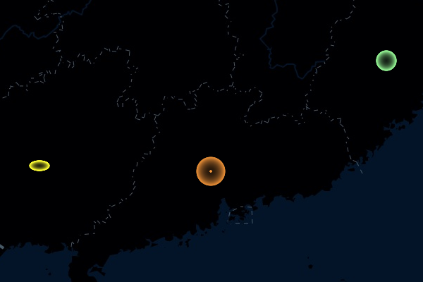
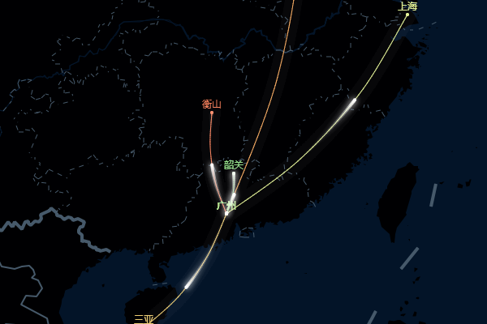
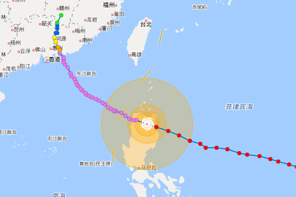
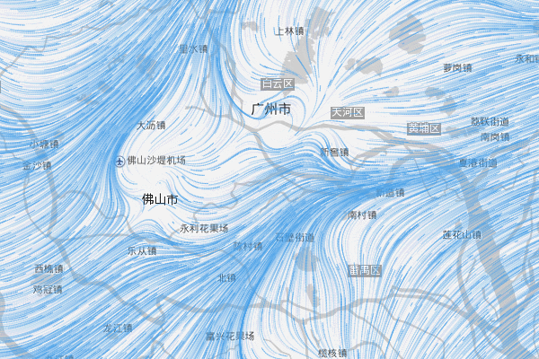
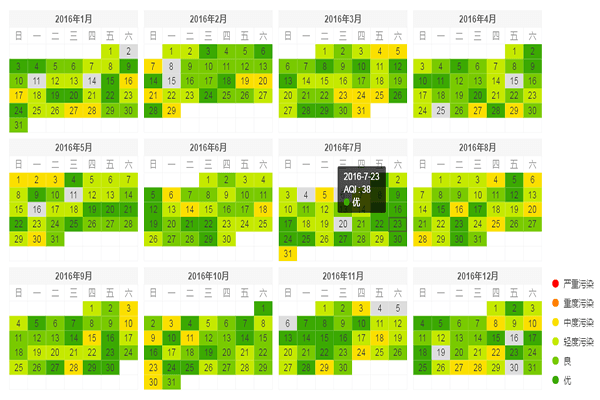
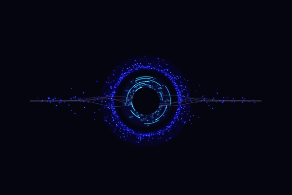
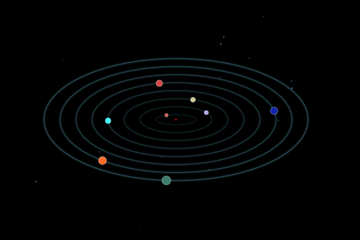

# map-canvas
基于baidu、google、openlayers、arcgis、高德地图扩展canvas图层，进行数据可视化。

## demos
* [百度地图-闪烁](https://chengquan223.github.io/map-canvas/examples/baidu-map-flashmarker.html) 

* [百度地图-迁徙](https://chengquan223.github.io/map-canvas/examples/baidu-map-move.html) 

* [百度地图-台风](https://chengquan223.github.io/map-canvas/examples/baidu-map-typhoon.html) 

* [百度地图-风](https://chengquan223.github.io/map-canvas/examples/baidu-map-wind.html) 

* [canvas-日历图-年份](https://chengquan223.github.io/dazv/examples/canvas-calendar-year.html) 

* [canvas-日历图-月份](https://chengquan223.github.io/dazv/examples/canvas-calendar-month.html) 

* [canvas-数据眼](https://chengquan223.github.io/map-canvas/examples/canvas-dataEye.html) 

* [canvas-气泡](https://chengquan223.github.io/map-canvas/examples/canvas-bubble.html) 

* [canvas-行星](https://chengquan223.github.io/map-canvas/examples/canvas-planet.html) 
